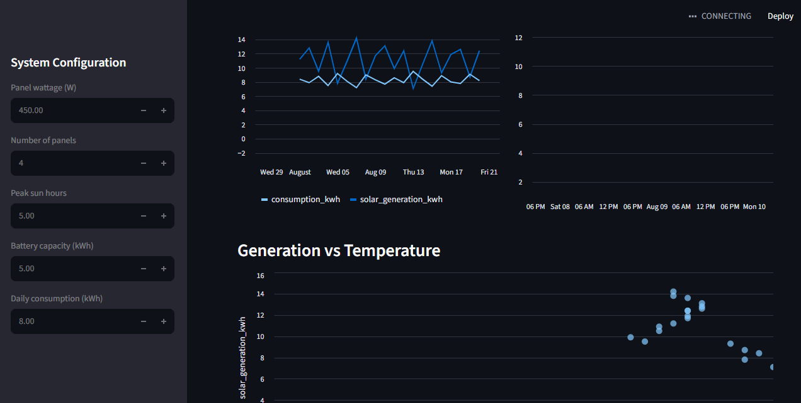
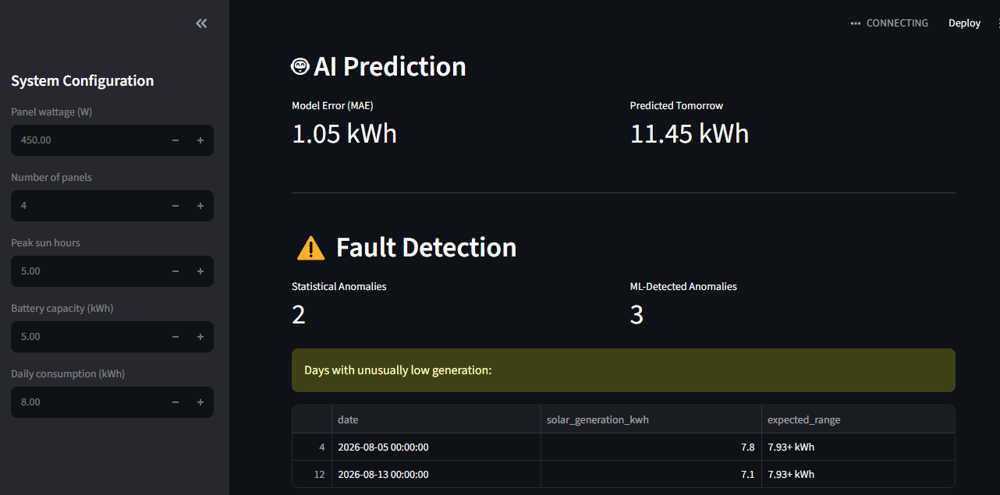
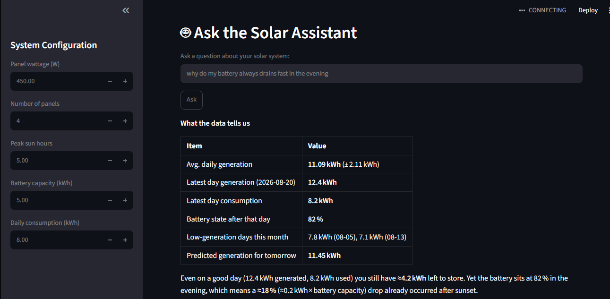

# ☀️ Tambo Solar AI System

An AI-powered solar energy monitoring, prediction, and diagnostic dashboard built with Python.

## Features

- **Solar Calculator** — computes system capacity, daily generation estimates, and battery backup time
- **Historical Data Analysis** — Pandas-based summary statistics and deficit detection
- **Performance Dashboard** — Matplotlib/Seaborn visualizations of generation, consumption, and temperature trends
- **AI Prediction** — Random Forest model forecasting next-day solar generation
- **Fault Detection** — statistical and Isolation Forest anomaly detection to flag underperforming days
- **AI Solar Assistant** — natural-language Q&A about your system's performance, powered by an LLM (Groq)
- **Interactive Web App** — full Streamlit dashboard tying everything together

## Tech Stack

| Technology | Purpose |
|---|---|
| Python | Core language |
| NumPy | Numerical calculations |
| Pandas | Data management |
| Matplotlib / Seaborn | Data visualization |
| Scikit-learn | Machine learning (prediction + anomaly detection) |
| Streamlit | Web dashboard |
| Groq API | LLM-powered natural language assistant |

## Project Structure

\```
solar-ai-system/
├── main.py                 # CLI version - runs the full pipeline
├── app.py                  # Streamlit web dashboard
├── solar_calculator.py     # Phase 1: core calculations
├── data_manager.py         # Phase 2: data loading & analysis
├── visualizer.py           # Phase 3: charts
├── predictor.py            # Phase 4: ML prediction
├── anomaly_detector.py     # Phase 6: fault detection
├── ai_assistant.py         # Phase 7: LLM assistant
├── solar_data.csv          # Sample dataset
├── requirements.txt
└── README.md
\```

## Setup

1. Clone this repository
2. Install dependencies:
   \```
   pip install -r requirements.txt
   \```
3. Create a `.env` file with your Groq API key:
   \```
   GROQ_API_KEY=your_key_here
   \```
4. Run the web dashboard:
   \```
   python -m streamlit run app.py
   \```

## Sample Output

 
 
 
 


## Future Improvements

- Real-time data ingestion from actual inverter/battery hardware
- Multi-day forecasting instead of single-day prediction
- User authentication for multi-system tracking

## Author

Built as a learning project combining solar energy domain knowledge with Python and AI engineering skills.